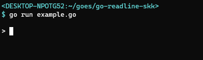

go-readline-skk
================

このパッケージは Go言語製のコマンドライン向けの一行入力パッケージ [go-readline-ny] に [SKK] ライクな「かな漢字変換機能」を実現するアドオンです。



```example.go
package main

import (
    "context"
    "fmt"
    "os"

    "github.com/hymkor/go-readline-skk"
    "github.com/nyaosorg/go-readline-ny"
    "github.com/nyaosorg/go-readline-ny/keys"
)

func mains() error {
    var ed readline.Editor

    // ~/ はパッケージ側で展開されます
    skkMode, err := skk.Config{
        UserJisyoPath:     "~/.go-skk-jisyo",
        SystemJisyoPaths:  []string{"SKK-JISYO.L", "SKK-JISYO.emoji"},
        CtrlJ:             keys.CtrlJ,
        DontDisableOnExit: false,
        BindTo:            &ed,
        // BindTo:           readline.GlobalKeyMap,
    }.Setup()

    if err != nil {
        return err
    }
    defer skkMode.SaveUserJisyo()

    for {
        text, err := ed.ReadLine(context.Background())
        if err != nil {
            return err
        }
        fmt.Println("TEXT:", text)
    }
    return nil
}

func main() {
    if err := mains(); err != nil {
        fmt.Fprintln(os.Stderr, "Error:", err.Error())
        os.Exit(1)
    }
}
```

[go-readline-ny]: https://github.com/nyaosorg/go-readline-ny
[SKK]: https://ja.wikipedia.org/wiki/SKK
